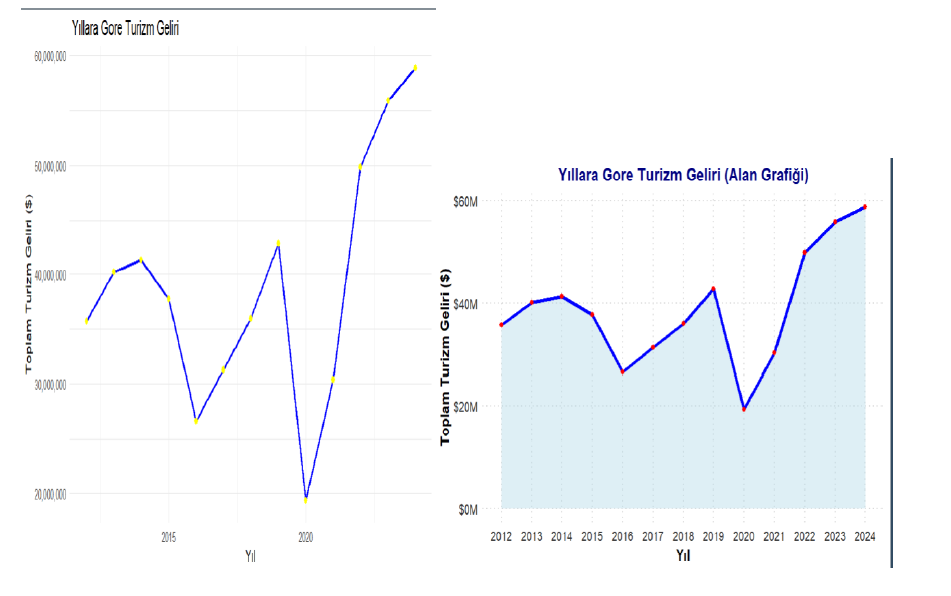
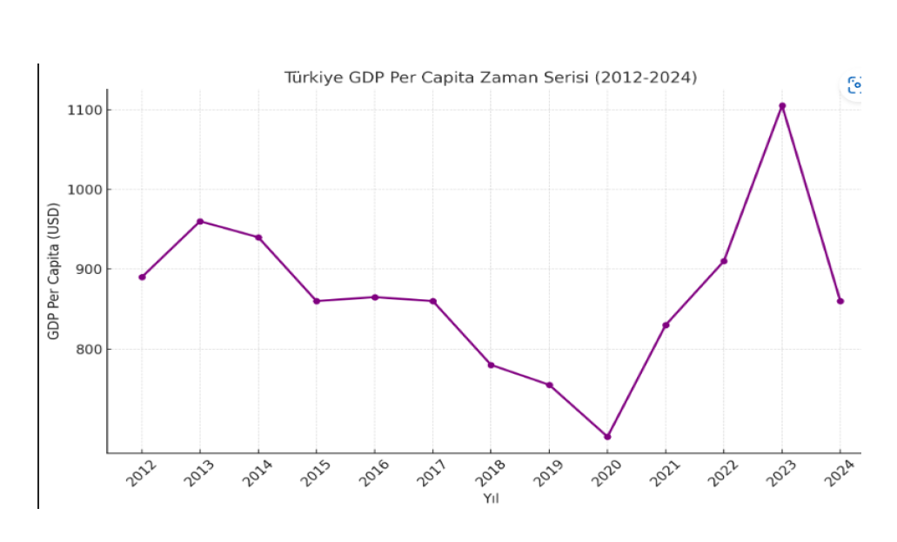

# 📈 Türkiye Turizm Gelirleri ve Ekonomik Büyüme (GSYİH) Analizi (2012-2024)

Bu proje, Türkiye ekonomisinde stratejik öneme sahip olan turizm sektörü ile ekonomik büyüme (GSYİH) arasındaki ilişkiyi ekonometrik zaman serisi yöntemleriyle analiz etmektedir. Proje, verilerin işlenmesinden ekonometrik modelleme aşamasına kadar uçtan uca bir veri analizi sürecini kapsamaktadır.

## 🎯 Projenin Amacı
Turizm gelirlerinin uzun dönemli ekonomik büyüme üzerindeki etkisini kantitatif olarak ölçmek ve değişkenler arasındaki dinamik ilişkiyi **ARDL (Autoregressive Distributed Lag)** modeli ile ortaya koymaktır.

## 🛠 Kullanılan Teknolojiler & İstatistiksel Yöntemler
- **Programlama Dili:** R
- **Kütüphaneler:** `tidyverse`, `ggplot2`, `dynlm`, `urca`, `tseries`
- **Metodoloji:**
  - **Durağanlık Analizi:** ADF (Augmented Dickey-Fuller) ve PP (Phillips-Perron) testleri ile serilerin durağanlık seviyeleri test edilmiştir.
  - **Modelleme:** Kısa ve uzun dönem ilişkileri için ARDL ve Hata Düzeltme Modeli (ECM).
  - **Görselleştirme:** Alan grafikleri, zaman serisi trend analizleri ve korelasyon ısı haritaları.

## 📊 Öne Çıkan Bulgular
1.  **Durağanlık:** Serilerin seviyede durağan olmadığı, ancak birinci farklarında [I(1)] durağanlaştığı saptanmıştır.
2.  **Eşbütünleşme:** Turizm gelirleri ile GSYİH arasında uzun dönemli bir ilişki (**Cointegration**) tespit edilmiştir.
3.  **Model Başarısı:** Kurulan model, turizm gelirlerindeki değişimin yaklaşık **%31'ini** açıklama kapasitesine sahiptir.

## 🖼️ Analiz Görselleri
Aşağıda analiz sürecinde elde edilen temel bulgular yer almaktadır:

### 1. Turizm Geliri Trend Analizi (2012-2024)

### 2. Değişkenler Arası Korelasyon Matrisi

### 3. Türkiye GSYİH Zaman Serisi Analizi

## 📂 Dosya Yapısı
- `/scripts`: Analiz sürecini içeren R kodları 
- `/data`: Kullanılan ham veri setleri 
- `/outputs`: Analizden elde edilen görsel çıktıları 
- `/report`: Projenin detaylı akademik raporu 
