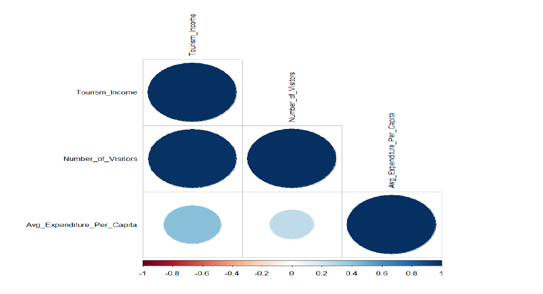

# 📈 Türkiye Turizm Gelirleri ve GSYİH İlişkisi Analizi (2012-2024)

Bu çalışma, Türkiye ekonomisinin en kritik sektörlerinden biri olan turizmin, ekonomik büyüme (GSYİH) üzerindeki etkisini ekonometrik zaman serisi yöntemleriyle analiz etmektedir.

## 🎯 Proje Özeti
Proje, 2012-2024 dönemine ait verileri kullanarak turizm gelirlerinin makroekonomik büyüme ile olan bağını **ARDL (Autoregressive Distributed Lag)** modeli üzerinden incelemektedir. Analiz süreci; veri temizleme, durağanlık testleri, modelleme ve sonuçların yorumlanması aşamalarından oluşmaktadır.

## 🛠 Kullanılan Teknolojiler & İstatistiksel Yöntemler
- **Programlama Dili:** R
- **Kütüphaneler:** `tidyverse`, `ggplot2`, `dynlm`, `urca`, `tseries`
- **Metodoloji:**
  - **Durağanlık Analizi:** ADF ve PP testleri ile serilerin I(1) seviyesinde durağanlaştığı saptanmıştır.
  - **Modelleme:** Kısa ve uzun dönem ilişkileri için ARDL ve Hata Düzeltme Modeli (ECM).
  - **Görselleştirme:** Trend analizleri ve Korelasyon matrisleri.

## 📊 Öne Çıkan Bulgular
- **Korelasyon:** Turizm gelirleri ile ziyaretçi sayısı arasında %90'ın üzerinde pozitif korelasyon gözlemlenmiştir.
- **Model Çıktısı:** Kurulan model, turizm gelirlerindeki değişimin yaklaşık **%31'ini** açıklama kapasitesine sahiptir.
- **Eşbütünleşme:** Değişkenlerin uzun dönemde birlikte hareket ettiği (Cointegration) istatistiksel olarak kanıtlanmıştır.

## 🖼️ Analiz Görselleri
Aşağıda analiz sürecinde elde edilen temel grafiklerden örnekler yer almaktadır:

### Turizm Geliri Trendi (2012-2024)

### Değişkenler Arası Korelasyon Matrisi

## 📂 Dosya Yapısı
- `/scripts`: R analiz kodları (`analysis.R`).
- `/data`: Ham veri setleri (Gelir, Gider, GDP CSV dosyaları).
- `/outputs`: Analizden elde edilen grafikler (.png).
- `/report`: Projenin detaylı akademik raporu (PDF formatında).
